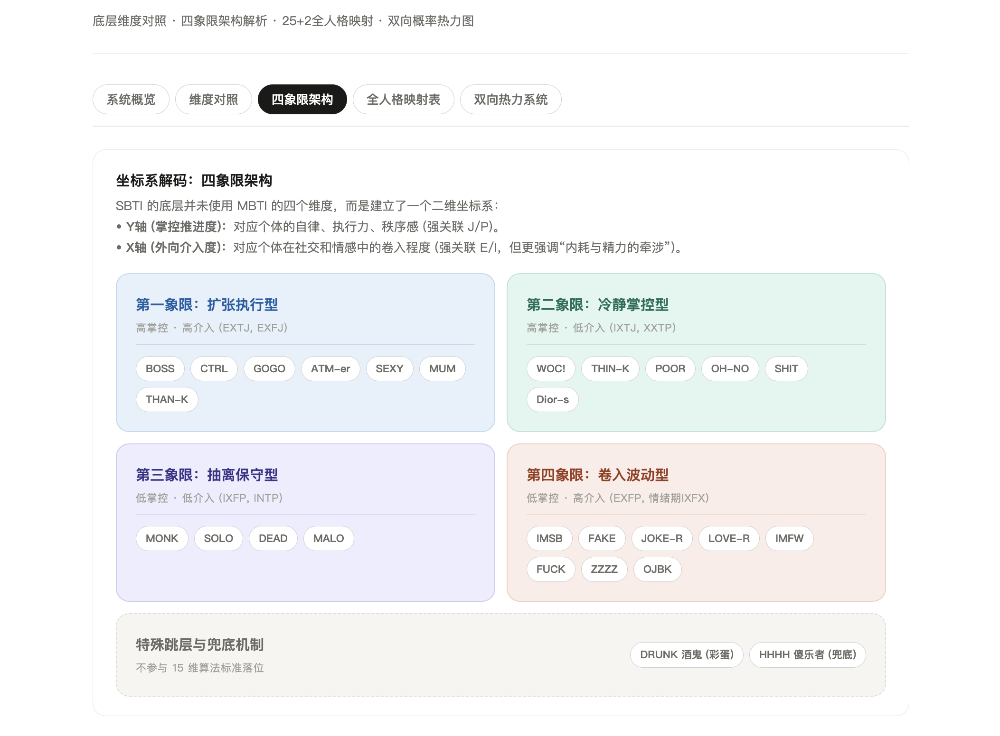
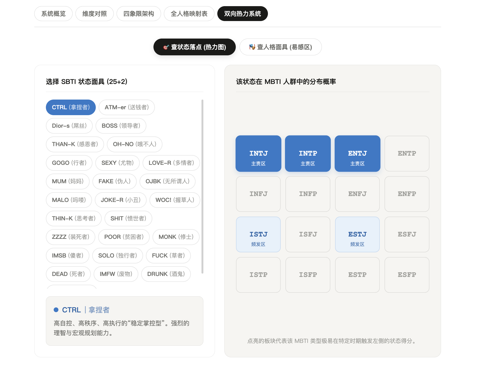
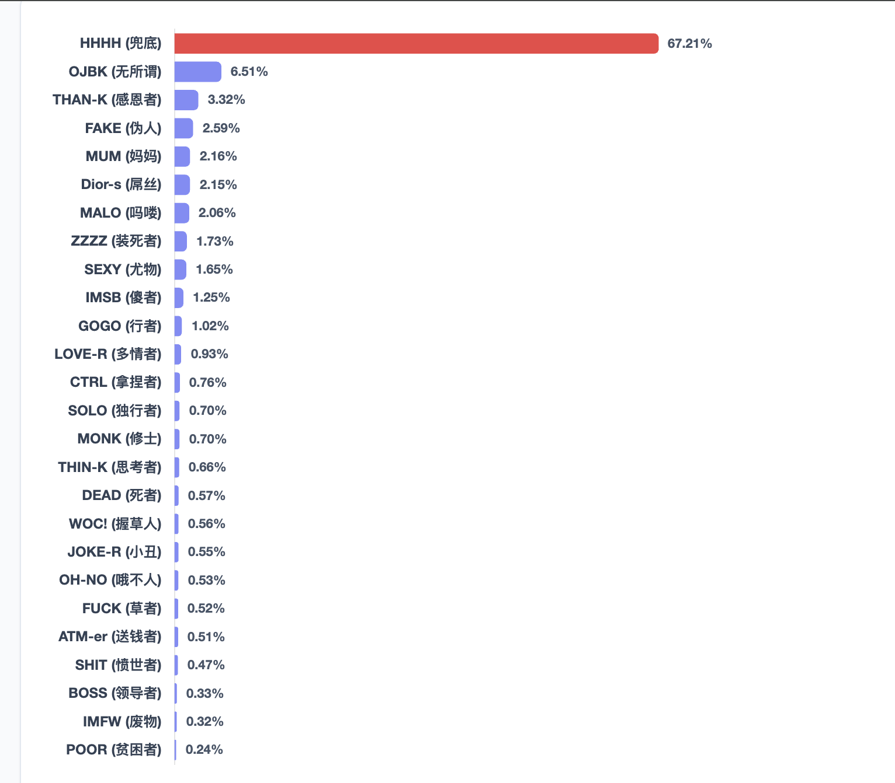

# SBTI与MBTI测试映射关系分析：从静态定性到动态概率云模型的范式转换


## 摘要

本文尝试把一套网络流行人格测试 SBTI 与 MBTI/16Personalities 放到同一个分析框架里讨论，但不把两者粗暴地当成一一对应的标签翻译器。核心观点很简单：**MBTI 更接近相对稳定的特质偏好描述，SBTI 更接近在具体社会情境中被放大的状态性呈现**。因此，SBTI 与 MBTI 的关系，与其说是“类型等价”，不如说更像“特质基线与状态面具”的关系。

本文一方面根据 SBTI 前端代码重建其可验证的计算逻辑，另一方面结合人格心理学、状态-特质区分、印象管理、情绪劳动与倦怠研究，提出一个更适合解释现实结果分布的框架：**从静态定性映射，转向四象限与概率云的动态映射**。

## 引言：为什么需要重写映射逻辑

近期，自我基础特征测试（SBTI）在中文社交媒体中引发了很高的讨论度。最直观的受众反应，通常是把 SBTI 结果和 MBTI 做静态对照，例如把 `CTRL` 直接理解为 ENTJ，把 `SOLO` 直接理解为 INTJ，把 `LOVE-R` 直接理解为 INFP。

这种理解方式很自然，但也很快会遇到两个问题。

第一，同一种 MBTI 在 SBTI 中往往会分流到多个结果，而不是稳定落在单一状态。第二，很多 SBTI 结果看上去“外显”，但其高频对应人群里却可能包含相当比例的 I 型个体；反过来，一些表面安静、抽离的结果，也未必只属于典型 I 型。这说明，两套系统虽然有可对照的地方，但它们捕捉的不是同一个层次的心理结构。

换句话说，问题不在于“哪一个标签翻译错了”，而在于**我们一开始就把两把不同的尺子当成同一种尺子来用**。

## 一、两套系统到底在测什么

### 1.1 系统概览

```{r fig-overview}

```

如果用最简洁的话概括：

- **SBTI**：15 个维度，先做维度离散化，再与人格模板做相似性匹配。
- **MBTI / 16P**：4 个核心维度加一个 A/T 维度，更强调长期偏好的方向和强弱。

从测量哲学上说，SBTI 更像一种“当前心理资源配置”和“社会情境下行为风格”的组合读数；MBTI 更像对个体相对稳定的认知偏好做分类描述。前者更接近状态，后者更接近特质。这种区分并不是本文凭空创造的。人格心理学长期都在讨论：稳定特质是否必须通过变化中的状态来体现，以及同一个人如何在不同场景下呈现出宽幅波动，但整体分布依然稳定（Fleeson, 2001; Fleeson & Jayawickreme, 2015）。

### 1.2 SBTI 更像“状态性人格面具”

SBTI 的 15 个维度分布在 5 个模型中：

- **S维（自我模型）**：自尊、自我清晰度、核心价值
- **E维（情感模型）**：依恋安全感、情感投入度、边界与依赖
- **A维（态度模型）**：世界观、规则与灵活度、意义感
- **Ac维（行动驱力）**：动机导向、决策风格、执行模式
- **So维（社交模型）**：社交主动性、人际边界感、表达与真实度

这些维度里，只有一部分能和 MBTI 的经典维度形成较强对应。另一些维度，例如依恋安全感、自尊、自我清晰度、情绪投入、边界感，本身已经超出了 MBTI 的原始测量目标。它们更像是个体在特定阶段中，如何防御、如何卷入、如何保全自我、如何调配心理资源。

这也是为什么 SBTI 经常测出来的是一种“状态像”，而不只是“人格像”。

### 1.3 MBTI 更像“底层偏好坐标”

相对而言，MBTI 或 16Personalities 版本的人格分类，更强调以下几类长期偏好：

- **E/I**：能量朝外还是朝内
- **S/N**：偏具体事实还是偏抽象关联
- **T/F**：偏逻辑判断还是偏价值与关系判断
- **J/P**：偏结构控制还是偏开放应对
- **A/T**：偏自信稳定还是偏自我怀疑、波动敏感

就算外界批评 MBTI 的心理测量性质有限，它讨论的仍然主要是**长期偏好结构**，而不是当下情绪、依恋焦虑、社会防御、情绪劳动过载等更动态的状态变量。

### 1.4 一个更合理的总判断

因此，更合理的表述不是“哪个 SBTI 等于哪个 MBTI”，而是：

> MBTI 更像人格的基底坐标，SBTI 更像在特定生活阶段、社会压力和互动环境中被激活出来的状态性面具。

这个判断和状态—特质区分是相容的，也和 Whole Trait Theory 的思路一致：人可以具有稳定的特质分布中心，但在短时间尺度上表现出大幅状态波动，而这些波动并不等于人格失真，恰恰就是人格在现实中的呈现方式（Fleeson, 2001; Fleeson & Jayawickreme, 2015）。

## 二、SBTI 的可验证算法：不是“神秘心理学”，而是模板匹配

这一部分不谈解释，先谈代码层面能确定的事情。

### 2.1 15 维、30 题、每维两题

SBTI 常规题一共 30 题，15 个维度，每个维度对应两道题。每题答案取值为 1、2、3，直接相加到该维度。

于是，每个维度的原始总分范围是：

- 最低 2
- 最高 6

### 2.2 三档离散化：L / M / H

代码中的离散化规则很直接：

- 总分 `<= 3` 记为 `L`
- 总分 `= 4` 记为 `M`
- 总分 `>= 5` 记为 `H`

所以，SBTI 不是直接拿连续分数去分类，而是先把连续分数压成 15 个三档标签。

### 2.3 模板匹配而不是“纯概率推断”

每种常规人格都有一套固定的 15 维模板，例如某些维度是 H，某些维度是 M，某些维度是 L。系统会把用户的 15 维结果，和这些模板逐一比较。

这里需要特别说明一点：**从代码重建看，SBTI 使用的是曼哈顿距离（Manhattan distance），不是欧氏距离（Euclidean distance）**。很多页面说明为了表达方便写成“向量距离”或“欧氏距离”，但从前端逻辑看，实际算法是逐维取绝对差，再求和。

换句话说，设用户在第 $i$ 维的取值为 $u_i$，某人格模板在第 $i$ 维的取值为 $t_i$，并把 L/M/H 编码为 1/2/3，则：

$$
D = \sum_{i=1}^{15} |u_i - t_i|
$$

系统会选择距离最小的那个模板作为最优匹配结果。

### 2.4 匹配度的来源

代码中的匹配度并不是统计意义上的“真实概率”，而是把距离压缩成一个更好读的百分比：

$$
Similarity = round\left((1 - D/30) \times 100\right)
$$

这里的 30 来自最大可能总距离：15 个维度，每维最大差 2。

所以，SBTI 给出的“相似度”更准确地说是一种**模板相近度分数**，不是一个经过外部样本校准后的心理测量概率。

### 2.5 两个特殊机制：DRUNK 与 HHHH

SBTI 还有两个明显不属于常规模板匹配的机制：

1. **DRUNK**：由隐藏题触发，属于特殊分支覆盖。
2. **HHHH**：当最佳模板匹配度低于阈值时，作为兜底结果出现。

这也意味着，SBTI 的输出并不完全只是“25 个常规模板里谁最近”，而是“最近模板 + 特殊规则覆盖 + 低匹配度兜底”共同决定。

# 三、为什么静态一一映射会失败

### 3.1 失败不只是因为“算法不够准”

很多人会误以为，SBTI 和 MBTI 对不上，只是因为映射表做得不够细。但更深层的原因是：

- **MBTI 的轴是对立式偏好轴**
- **SBTI 的维度里混入了大量状态变量和社会应对变量**

所以，它们的关系天然就更像“投影关系”，而不是“翻译关系”。

### 3.2 典型现象一：同一个 MBTI 可以掉进多个 SBTI

比如同样是 INFP，有些人在情感饱满、理想化时更容易落到 `LOVE-R`，在过度内耗时可能掉到 `IMSB`，在以幽默抵御脆弱时可能落到 `JOKE-R`，在防御性外放或崩裂式表达阶段也可能靠近 `FUCK`。

如果坚持“INFP = LOVE-R”这种点对点映射，就根本解释不了这些状态分叉。

### 3.3 典型现象二：表面外放，不等于底层外向

一些 SBTI 状态名非常外显，例如 `WOC!`、`FUCK`、`JOKE-R`，但这不代表它们的高频人群一定全是 E 型。原因是，SBTI 的“高介入”并不只测社交活跃度，还测**情绪卷入度、精力牵涉程度、内耗与外化反应**。

也就是说，一个 I 型人完全可能因为高压、高情绪卷入、高共情或高防御，而在 SBTI 上呈现出非常强的外显张力。

## 四、四象限架构：把“类型表”改成“状态空间”

### 4.1 为什么四象限比点对点更合理

如果不把 SBTI 视为 MBTI 的翻译器，而把它视为一个状态空间，那么许多异常立刻就更好解释了。

这里最有用的二维框架是：

- **Y轴：掌控推进度**
  - 反映自律、决策、执行、秩序需求
  - 强关联 J/P，也和部分 T 风格相关

- **X轴：外向介入度**
  - 不是简单社交频率
  - 更接近社交卷入、情感卷入、精力牵涉与外化程度

```{r fig-quadrant}

```

### 4.2 四个象限的含义

#### 第一象限：扩张执行型

高掌控、高介入。常见于高执行、强推进、强外显责任感的人格状态，例如 `BOSS`、`CTRL`、`GOGO`、`ATM-er`、`MUM` 等。

#### 第二象限：冷静掌控型

高掌控、低介入。更多表现为清晰边界、理智控制、内在稳定推进，例如 `THIN-K`、`OH-NO`、`POOR`、`WOC!`、`SHIT` 等。

#### 第三象限：抽离保守型

低掌控、低介入。通常更接近能量回撤、低卷入、自我保护和抽离，例如 `MONK`、`SOLO`、`DEAD`、`MALO`。

#### 第四象限：卷入波动型

低掌控、高介入。通常伴随情绪内耗、关系卷入、表达外溢、面具切换和不稳定波动，例如 `IMSB`、`FAKE`、`JOKE-R`、`LOVE-R`、`IMFW`、`FUCK`、`ZZZZ`、`OJBK`。

### 4.3 这个框架如何解释所谓“反常”

这个框架最有价值的地方，不是它看上去更漂亮，而是它能解释为什么：

- 一个 I 型人也能掉进高介入象限
- 一个 F 型人也可能落到极端防御或冷静掌控区
- 一个平时稳定的人，在高压阶段会从主象限漂移到边缘象限

这比“哪个 MBTI 对应哪个 SBTI”要接近现实得多。

## 五、从一一对应到概率云：为什么应该做双向热力图

### 5.1 核心思路

一旦承认 SBTI 是状态空间，就不应该再做僵硬的单点映射，而应该转向**双向概率云模型**。

也就是：

- **从 SBTI 查 MBTI**：问某个状态通常更容易由哪些底层人格偏好触发。
- **从 MBTI 查 SBTI**：问某种人格基底在不同情境下最容易掉进哪些状态面具。

### 5.2 可视化的意义

```{r fig-heatmap}

```

热力图不是为了制造“更花哨的标签学”，而是为了提醒读者：

1. **主阵地不是唯一阵地**
2. **边缘区不是错误，而是漂移区**
3. **人格不是固定贴纸，而是带有分布的状态云**

### 5.3 这种方法比静态映射好在哪里

静态映射的问题是，它假设一个 MBTI 类型天然只会长成一个 SBTI 面具。但现实中，人格的表现总受场景、角色、情绪劳动、关系压力与资源耗竭影响。

如果把 MBTI 视为“结构中心”，把 SBTI 视为“状态分布”，那么“一个 MBTI 对应多个 SBTI”就不再是错误，而变成了理论上本来就应该出现的现象。

## 六、社会学与社会心理学解释：为什么这些标签会引发共鸣

### 6.1 Goffman：面具不是虚假，而是互动秩序的一部分

Goffman 在《日常生活中的自我呈现》中强调，人并不是在社会中直接暴露一个纯粹自我，而是在不同场景中管理印象、调整角色、维持互动秩序。用这个视角看，`FAKE`、`JOKE-R`、`WOC!` 之类的结果，并不只是“人设”或“装”，而更像是现实互动中常见的自我呈现策略。

这说明 SBTI 被大量讨论，不只是因为它在“测人格”，而是因为它把很多人熟悉却难以明说的社会面具，用更直白、更具戏剧性的名称表达出来了（Goffman, 1959）。

### 6.2 Hochschild：情绪劳动与人格面具的社会基础

Hochschild 的情绪劳动研究指出，现代服务社会中，个体经常需要管理和展示情绪，以符合组织、角色或关系的期待。这种长期的情绪管理，会制造出外在表达与内在真实感之间的张力（Hochschild, 1983）。

如果把这个理论带回 SBTI，那么 `FAKE`、`MUM`、`JOKE-R`、`IMFW` 等状态的流行，就不是偶然。它们都指向了一种典型经验：**外界要求我持续扮演某个可被接受的样子，而我内部并不总是能无代价地维持这个样子。**

### 6.3 倦怠与抽离：为什么第三象限容易让人觉得“真实”

现代倦怠研究通常把疲惫、犬儒、效能感下降视为长期高压后的典型反应。Maslach 的工作，和后续大量关于 burnout 的研究，都反复指出：当投入长期高于回报，个体会转向退缩、钝化、抽离与自我保全（Maslach & Leiter, 2016）。

这正好能解释第三象限的吸引力。`DEAD`、`SOLO`、`MONK` 之所以被很多人觉得“准”，并不一定是因为这些人底层人格就天然疏离，而可能是他们处在一个高压、低回报、低控制感的阶段，只能通过降低介入来保住自己。

### 6.4 为什么第四象限特别拥挤

第四象限里常见的是高卷入、低掌控。它像一种非常当代的状态：

- 很在意
- 很容易卷进去
- 但未必真的有足够掌控感
- 于是开始内耗、表演、爆裂、迎合、摆烂、反复拉扯

这与许多年轻人在平台社交、亲密关系、情绪劳动和自我呈现中的经验高度贴近。也正因为如此，SBTI 的许多标签其实不是在“发明人格”，而是在**命名一种当代社会经验**。

## 七、穷举空间与“兜底机制”：算法上说明了什么

### 7.1 为什么可以做穷举讨论

SBTI 的 15 个维度每个只有 3 种取值（L/M/H），因此理论状态空间大小为：

$$
3^{15} = 14,348,907
$$

这个数字虽然不小，但在计算上并不是不可处理的天文规模。也正因此，讨论“所有理论组合在模板空间里的分布”是有意义的。

### 7.2 兜底结果为什么会很多

从你目前的分布图看，`HHHH` 兜底结果在理论空间中占比很高。这个现象非常重要，因为它说明：

- 模板人格只覆盖了有限的“高一致性人格构型”
- 大量随机拼出来的 15 维组合，其内部逻辑并不自洽
- 系统用 `HHHH` 把这些“离所有模板都不够近”的组合吸收掉了

```{r fig-exhaustive}

```

换句话说，真正能落进 24/25 个具象人格里的，不只是“算法刚好分过去了”，而是这些组合本身更像现实中会一起共现的心理结构。

### 7.3 中间型为什么地盘更大，极端型为什么更稀有

如果某个人格模板包含较多 M 值，它在状态空间中的容忍半径通常更大，因此会覆盖更多组合。相反，若一个人格高度极化，要求大量维度同时接近全 H 或全 L，它在空间中占到的“领地”就会更小。

这意味着：

- 像 `OJBK`、`MUM` 这类更包容、中间值较多的结果，更容易收纳大量中庸型组合
- 像 `CTRL`、`DEAD`、`MONK` 这类极化人格，需要更强的一致性，因此更稀有

这个观察从数学上也支持一个直觉：**越极端、越纯的状态结果，越不像随机误差，更像一种内在高度一致的心理组织。**

## 八、方法论上的边界：这不是正式临床或标准人格测量

为了避免把分析写成“万物都能解释”，这里必须明确几条限制。

### 8.1 MBTI 本身并不是无争议量表

MBTI 在大众传播中影响很大，但学术心理学界长期对其信度、效度和二分法建构方式有争议。本文把它作为“相对稳定的偏好坐标”来讨论，是出于解释便利，而不是把它当作黄金标准。

### 8.2 SBTI 的标签高度文化化、平台化

SBTI 的命名风格、题目风格和传播语境，明显带有中文互联网语境、平台表演性和社会情绪背景。它的魅力恰恰来自这一点，但这也意味着它并不是一个去语境化、跨文化通用的标准人格测验。

### 8.3 本文模型是解释性模型，不是严格验证性模型

本文提出的“四象限 + 概率云”框架，适合解释现象、组织观察、改进可视化和避免误读。但它不是已经完成大样本验证、测量不变性检验和正式心理测量标定的成品模型。

更准确地说，它是一个**比静态一一映射更合理的解释框架**，而不是最终版人格科学定论。

## 结论

本文的核心结论可以压缩为四句话。

第一，SBTI 与 MBTI 测的不是同一个层次的东西。MBTI 更像底层偏好，SBTI 更像在具体情境中被激活的状态性面具。

第二，SBTI 的前端算法本质上是 15 维离散化后的模板匹配，而不是某种复杂、神秘、不可解释的深层推理模型。

第三，把 SBTI 和 MBTI 做点对点静态翻译，理论上站不住，经验上也解释不了真实分布。比起“谁等于谁”，更合理的做法是讨论“谁更容易在哪些状态区间里出现”。

第四，四象限与双向概率云模型，至少在解释层面上，比静态映射更接近现实。它允许我们承认：人格有相对稳定的核，但人也会因为关系、压力、角色和社会环境，戴上不同的状态面具。

如果说传统映射问的是“你到底是哪一种人”，那么这个新模型问的其实是另一件更接近现实的问题：

> **你大致是谁，以及在什么情境下，你最容易变成什么样。**

## 参考文献

Fleeson, W. (2001). Toward a structure- and process-integrated view of personality: Traits as density distributions of states. *Journal of Personality and Social Psychology, 80*(6), 1011-1027. https://doi.org/10.1037/0022-3514.80.6.1011

Fleeson, W., & Jayawickreme, E. (2015). Whole Trait Theory. *Journal of Research in Personality, 56*, 82-92. https://doi.org/10.1016/j.jrp.2014.10.009

Goffman, E. (1959). *The Presentation of Self in Everyday Life*. New York: Doubleday.

Hochschild, A. R. (1983). *The Managed Heart: Commercialization of Human Feeling*. Berkeley: University of California Press.

Maslach, C., & Leiter, M. P. (2016). Understanding the burnout experience: Recent research and its implications for psychiatry. *World Psychiatry, 15*(2), 103-111. https://doi.org/10.1002/wps.20311

Mischel, W., & Shoda, Y. (1995). A cognitive-affective system theory of personality: Reconceptualizing situations, dispositions, dynamics, and invariance in personality structure. *Psychological Review, 102*(2), 246-268. https://doi.org/10.1037/0033-295X.102.2.246

Spielberger, C. D. (1983). *State-Trait Anxiety Inventory for Adults: Manual, Instrument and Scoring Guide*. Mind Garden.

Roberts, B. W., & DelVecchio, W. F. (2000). The rank-order consistency of personality traits from childhood to old age: A quantitative review of longitudinal studies. *Psychological Bulletin, 126*(1), 3-25. https://doi.org/10.1037/0033-2909.126.1.3

